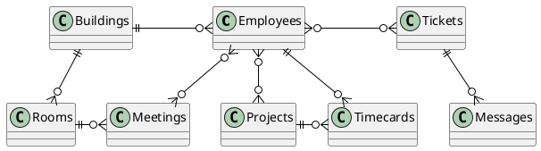

# The Busy Engineer's database encryption, featuring Amazon DynamoDB

Welcome to the Busy Engineer's database encryption workshop.
In this workshop, you will be guided through adding client-side encryption
with KMS and the AWS Database Encryption SDK.
Each exercise has step-by-step instructions.
Each exercise also has a `-complete` version available to use as a reference.

## Background: The Employee Portal Service

This example codes form [DynamoDb Deep Dive: Advanced Design Patterns](https://youtu.be/xfxBhvGpoa0?t=2293).
Seriously, it’s a really good talk and will change the way you think about and use DynamoDb.
Here is the entity relationship diagram for the service you will be working on.



As you begin this workshop,
this system uses DynamoDB to store records for searching.
All record are stored in a single DynamoDB table
with global secondary indexes.


```plantuml alt="Beginning architecture overview" title="Beginning architecture overview"
@startuml

skinparam BackgroundColor transparent

!define AWSPuml https://raw.githubusercontent.com/awslabs/aws-icons-for-plantuml/v15.0/dist
!include AWSPuml/AWSCommon.puml
!include AWSPuml/AWSSimplified.puml
!include AWSPuml/SecurityIdentityCompliance/all.puml


!include AWSPuml/Database/all.puml
!include AWSPuml/Storage/all.puml
!include AWSPuml/DeveloperTools/all.puml
!include AWSPuml/Groups/all.puml

DynamoDBItem(DDBItem, "Item", "")

AWSGroupColoring(Cloud9Instance, #FFFFFF, #3B48CC, plain)
AWSGroupEntity(IDE, "Workshop Instance", #3B48CC, Cloud9, Cloud9Instance) {
  ToolsandSDKs(EmployeePortalService, "", "")
}

AWSGroupColoring(DDBService, #FFFFFF, #3B48CC, plain)
AWSGroupEntity(DDBGroup, "Amazon DynamoDB", #3B48CC, DynamoDB, DDBService) {
  DynamoDBItems(DDBTable, "Table", "")
  DynamoDBGlobalsecondaryindex(GSI1, "GSI", "")
  DynamoDBGlobalsecondaryindex(GSI2, "GSI", "")

  DDBTable --> GSI1
  DDBTable --> GSI2
}

EmployeePortalService <- DDBItem
DDBItem -> DDBGroup

@enduml
```

After your work in the workshop is complete,
you will have have created another DynamoDB table
that contains records client-side encrypted
with the AWS Database Encryption SDK.
This new table will support all the access patterns
from the plaintext version.
You will be able to execute DynamoDB queries
on this client-side encrypted as well as a plaintext version.
You can explore how to build and query data in DynamoDB.


```plantuml alt="Final architecture overview" title="Final architecture overview"
@startuml

skinparam BackgroundColor transparent

!define AWSPuml https://raw.githubusercontent.com/awslabs/aws-icons-for-plantuml/v15.0/dist
!include AWSPuml/AWSCommon.puml
!include AWSPuml/AWSSimplified.puml
!include AWSPuml/SecurityIdentityCompliance/all.puml


!include AWSPuml/Database/all.puml
!include AWSPuml/Storage/all.puml
!include AWSPuml/DeveloperTools/all.puml
!include AWSPuml/Groups/all.puml


AWSGroupColoring(KMSService, #FFFFFF, #3B48CC, plain)
AWSGroupEntity(AWSKMS, "AWS KMS", #3B48CC, KeyManagementService, KMSService)

IdentityAccessManagementDataEncryptionKey(DataKey, "DataKey", "")

AWSGroupColoring(EncryptedDDBItemColor, #FFFFFF, #3B48CC, plain)
AWSGroupEntity(EncryptedItem, "EncryptedItem", #3B48CC, IdentityAccessManagementEncryptedData, EncryptedDDBItemColor) {
  DynamoDBItem(DDBItem, "Item", "")
}
IdentityAccessManagementDataEncryptionKey(DataKey, "", "")

AWSGroupColoring(Cloud9Instance, #FFFFFF, #3B48CC, plain)
AWSGroupEntity(IDE, "Workshop Instance", #3B48CC, Cloud9, Cloud9Instance) {
  ToolsandSDKs(EmployeePortalService, "", "")
}

AWSGroupColoring(DDBService, #FFFFFF, #3B48CC, plain)
AWSGroupEntity(DDBGroup, "Amazon DynamoDB", #3B48CC, DynamoDB, DDBService) {
  DynamoDBItems(DDBTable, "Table", "")
  DynamoDBGlobalsecondaryindex(GSI1, "GSI", "")
  DynamoDBGlobalsecondaryindex(GSI2, "GSI", "")

  DDBTable --> GSI1
  DDBTable --> GSI2
}

EmployeePortalService <- DDBItem
DDBItem -> DDBGroup

AWSKMS <-- DataKey
DataKey --> EmployeePortalService

@enduml
```

## Exercises

In this workshop, you will work through the following exercises:

1. Adding the AWS Database Encryption SDK
1. Adding searchable encryption configuration
1. Adding the remaining access patterns

## Getting Started

Ready to start? Proceed to [Getting Started](./getting-started.md) to begin.
